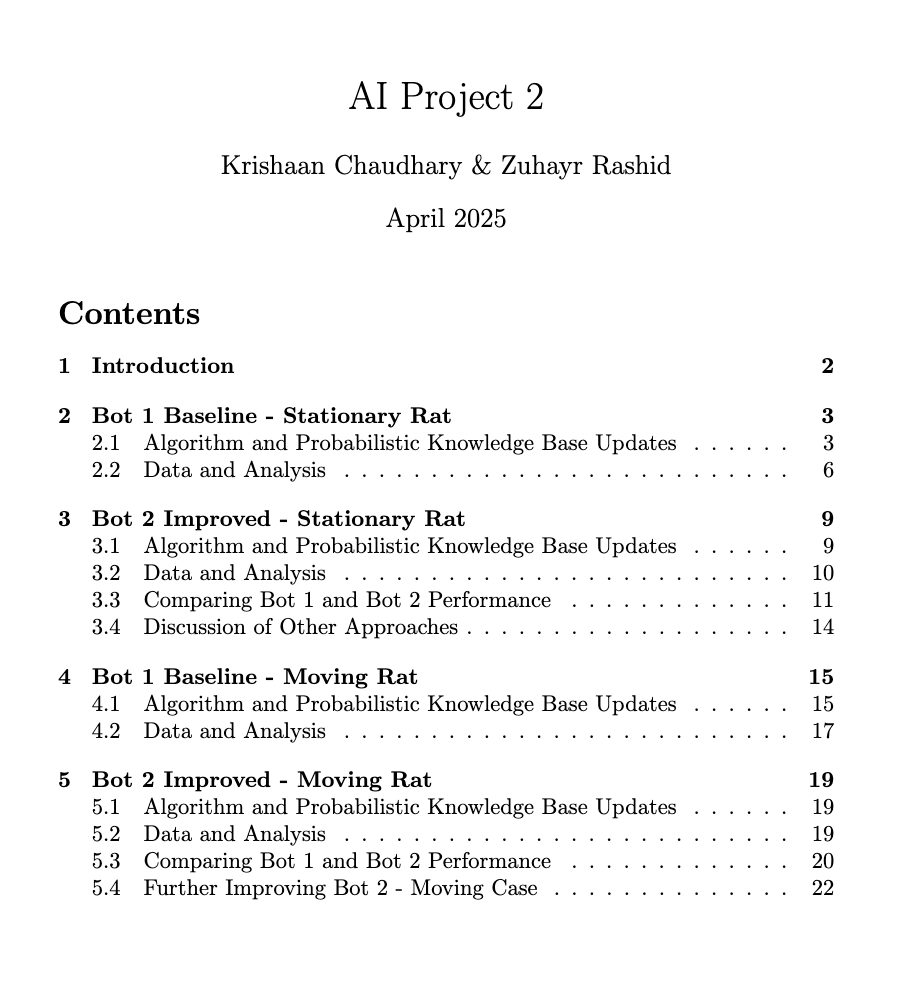

# Bayesian Agents for Stochastic Pursuit in Maze Environments

## Overview

This project involves designing and implementing four bots to capture a rat in a 30x30 grid maze representing a ship. The bots operate in 2 phases: 
1. **localization**: First, it localizes its position by sensing around and cross referencing blocked cells and
possible movements with a map of the maze. 
2. **rat capture** Then, it uses a rat sensor which pings probabalistically if the rat is near and does not ping if the rat is far to determine where
the rat is and plan a path to capture it. α is a parameter that controls the sensitivity of the rat pinging device. A high α corresponds to only hearing
pings if the rat is very near. 

Two cases are considered:
1. A **stationary rat**
2. A **rat moving randomly** to adjacent open cells

Two bots are developed for each case: a **baseline (Bot 1)** and an **improved version (Bot 2)**.


---

## Bot Descriptions

### Case 1: Stationary Rat

#### Bot 1 (Baseline)
- **Phase 1 (Localization)**:  
  Uses random movements and blocked neighbor sensing to localize the bot's position by eliminating impossible candidates.
- **Phase 2 (Rat Capture)**:  
  Employs a probabilistic knowledge base updated via Bayesian inference based on rat sensor pings. Uses A* to plan paths to the highest-probability cell.

#### Bot 2 (Improved)
Enhances Bot 1 with:
- Avoiding pings in zero-probability cells
- Limiting path lengths to 15 steps to adapt to new ping information
- Modified A* heuristic favoring high-probability cells
- Depth-First Search (DFS) for the special case of α = 0

---

### Case 2: Moving Rat

#### Bot 1 (Baseline)
- **Phase 1**: Identical to the stationary case
- **Phase 2**:  
  Accounts for random rat movement by updating the probabilistic knowledge base with a transition matrix and Bayesian updates after each ping and rat move

#### Bot 2 (Improved)
Builds on the stationary Bot 2 with:
- Shorter path commitment (10 steps) to handle rat movement
- Planning paths based on predicted future rat positions using a transition model

---

## Data and Analysis

### Simulation Setup
- 20 unique 30x30 grid mazes generated
- Tested with α values from 0.00 to 0.50 in increments of 0.02
- 10 runs per α value per maze → 100 runs per α

### Metrics
- Number of blocked cell detections
- Pings
- Movements
- Total timesteps

### Key Findings
- **Stationary Rat**:  
  Bot 2 outperforms Bot 1, especially for α = 0.05–0.20, due to efficient pinging and path planning
- **Moving Rat**:  
  Bot 2 shows slight improvements over Bot 1, enhanced further by shorter path commitments and future position predictions

---

## Installation

```bash
# Clone the repository
git clone https://github.com/KriChau95/AI-Project-2.git
cd AI-Project-2

# Install required dependencies
pip install numpy matplotlib
```

## Usage

Run all experiments and generate results:

```bash
python test.py
```

Generate visual plots for success rates and analysis:

```bash
python plot.py
```

---

## Detailed Technical Report

<a href="./Bayesian_Agents_for_Stochastic_Pursuit_in_Maze_Environments.pdf">
  
</a>

[Paper: Adaptive AI Navigation in Hazardous and Evolving Mazes](Bayesian_Agents_for_Stochastic_Pursuit_in_Maze_Environments.pdf)


